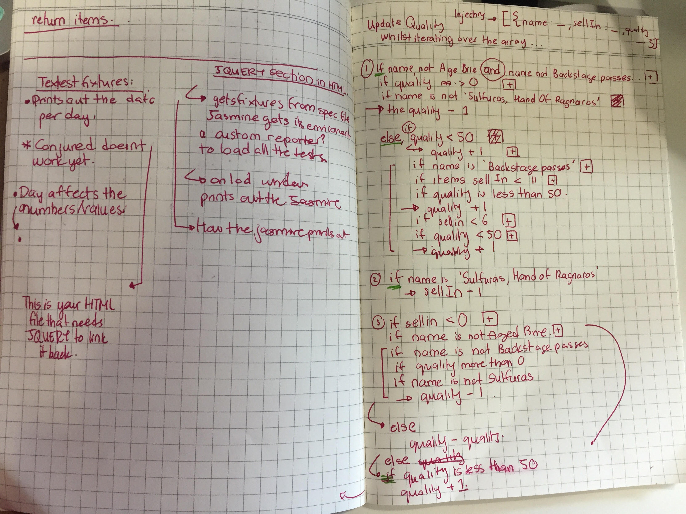

# Gilded Rose

The objective for this tech-test is to be able to understand the written code, refactor the code given and add a feature
to the code.

Gilded Rose is a small business that sells goods. Their goods
decrease in quality by the days, and specific goods decrease
or increase in value depending on the good.

## How To Use

## Approach

The first step was to understand what the requirements were. I summarised what the requirements were based on what was written by the client.

** What Items Have **
- All items have a SellIn value which denotes the number of days we have to sell the item
- All items have a Quality value which denotes how valuable the item is
- At the end of each day our system lowers both values for every item

** What Shop does (Rules) **
- Once the sell by date has passed, Quality degrades twice as fast
- The Quality of an item is never negative *
- The Quality of an item is never more than 50 *

- "Aged Brie" actually increases in Quality the older it gets
Sulfuras", being a legendary item, never has to be sold or decreases in Quality

- "Backstage passes", like aged brie, increases in Quality as its SellIn value approaches.
  - Quality increase by 2 if 10 days of less.  *
  - Quality increase by 3 when are 5 days or less. *
  - Quality drops to 0 after the concert

The second step was to understand the code itself. Thus, I explored each file to see what the code did. I analysed each
line of code, and documented them as such in the images below.

Writing what every file's role was and did allowed me to map the program and start seeing what I could test and extract for refactoring.

## Code Reflection
